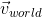
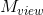
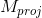

# shift.math

## Vectors

Vectors are always considered/written as column vectors  


As such we have to multiply a vector with some matrix from right to left:


You can easily construct vectors using the helper function `make_vector_from`:
```c++
// This constructs a four dimensional vector of integers.
auto v = make_vector_from(0, 1,  2, 3);
```

## Matrices

All matrices are stored in column major order:  


The memory layout of this matrix is 

It is important to note that matrices in source code are likely to be written in transposed form:
```c++
auto m = make_matrix_from_column_major<4, 4, int>(
   0,  1,  2,  3,
   4,  5,  6,  7,
   8,  9, 10, 11,
  12, 13, 14, 15);
```
To avoid confusion in some instances you may also use the alternative function `make_matrix_from_row_major`. It constructs a matrix from arguments in row major order but still stores all data in column major:
```c++
auto m = make_matrix_from_row_major<4, 4, int>(
   0,  4,  8, 12,
   1,  5,  9, 13,
   2,  6, 10, 14,
   3,  7, 11, 15);
```

## Quaternions

(ToDo)

## Math in Vulkan

We consistently use a right handed coordinate system to store model and scene data. The x-y axis span a horizontal plane whereas the z axis points upwards.
### Transformations

#### Object Space
Local coordinates  in object space are those stored in vertex buffers.

#### World Space
By multiplying each  with a model matrix  you get world space coordinates :


#### View Space
From world space each vector  needs to be transformed into the virtual camera's view space:


A view matrix  is nothing more than the inverse of the model matrix of the virtual camera object:


However, some view matrices can be computed without using an expensive inverse function:


with  being the transpose of the camera's rotation matrix (which is cheap to calculate) and  being a translation matrix of the negative camera position (moving the camera in one direction is like moving the world in the opposite direction).

#### Clip Space
By transforming view space using a projection matrix  we get homogeneous device coordinates (HDC) :


A vector  passes clip space if and only if all of the following conditions are met:


#### Normalized Device Coordinate Space
Each vector that passes clip space is transformed from homogeneous device coordinates to normalized device coordinates (NDC) by dividing the x, y, and z components with the fourth w component.


The resulting components are used for bounding, storage, and testing.

#### Screen/Window/Framebuffer Space
Finally  is transformed into screen/window/framebuffer space by multiplying the x and y components with the target size:


We usually don't get  automatically and have to compute it separately if we need pixel coordinates.

### Matrices

#### Projection Matrices
The projection matrix may be one of the following:

* an infinite perspective projection matrix  


* a finite perspective projection matrix  


* an infinite orthographic projection matrix  


* a finite orthographic projection matrix  

