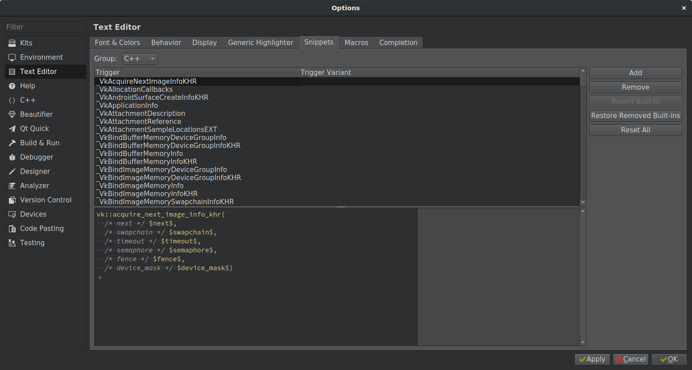
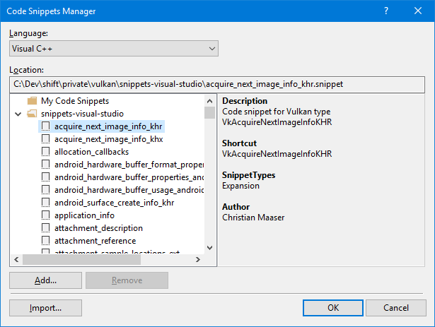

# shift.tools.vk2cpp - A Vulkan C++ Header Generator

## Overview

This tool translates the official [Vulkan](https://www.khronos.org/vulkan/) [specification](https://github.com/KhronosGroup/Vulkan-Docs/blob/master/xml/vk.xml) to C++. The resulting header offers several benefits compared to direct use of the official [Vulkan.h](https://github.com/KhronosGroup/Vulkan-Docs/blob/master/include/vulkan/vulkan.h) header:

* All Vulkan structures are translated to classes with getter and setter methods. While this alone wouldn't be of any benefit, there are additional overloads for certain setter methods to directly assign std::vector-s or std::array-s to array fields and also setting the corresponding count field in one go.
* All class types automatically assign the `sType` member.
* All class types automatically initialize all members minimizing risk of forgetting to assign single fields, which would result in undefined behavior.
* All class types offer constructors that initialize all members, thus allowing compact initialization of temporaries.
* Bit fields make use of strongly typed C++11 [enum class](https://en.cppreference.com/w/cpp/language/enum)es and [shift.core](../../core/doc/core.md)::bit_field type. This minimizes risk of using constants belonging to a different type.

Additionally, the tool generates code snippets for both Visual Studio 2017+ and QtCreator 4.7+.

## Usage

```
Allowed options:
  --help                                Shows this help message.
  --silent                              Disables logging to console.
  --no-logfile                          Disables logging to file.
  --log-level arg (=warn)               Selects a log level (may be one of 
                                        'debug', 'info', 'warn', or 'error')
  --log-arguments                       Writes all program arguments to the 
                                        log.
  --show-console arg (=1)               Show or hide the console window
  -i [ --input ] arg (="../private/vulkan/vk.xml")
                                        Path to the Vulkan XML specification to
                                        translate.
  -o [ --output ] arg (="../shift/render.vk/public/shift/render/vk/vulkan.h")
                                        Full path to a header file to write.
  --clang-format arg (="/usr/bin/clang-format")
                                        Path to the clang-format tool, used to 
                                        format the generated source code.
  --snippets-vs arg (="../private/vulkan/snippets-visual-studio/")
                                        Path to a folder where to write Visual 
                                        Studio code snippets.
  --snippets-qt arg (="../private/vulkan/snippets-qt-creator/")
                                        Path to a folder where to write 
                                        QTCreator code snippets.
  -g [ --graph ] arg (="../private/vulkan/vulkan.dot")
                                        Full path to a graphviz source file to 
                                        write.
```

## Code Snippets

Because most generated data structures are initialized using constructors with many arguments, hand written code using the generated Vulkan header might be difficult to read. Code snippets help writing readable code by adding parameter names as C-style comments to each argument.

Typing `_VkInstanceCreateInfo` in QtCreator, or `VkInstanceCreateInfo` in Visual Studio, and pressing CTRL+Space expands to
```
  vk::instance_create_info(
        /* next */ next,
        /* flags */ flags,
        /* application_info */ application_info,
        /* enabled_layer_count */ enabled_layer_count,
        /* enabled_layer_names */ enabled_layer_names,
        /* enabled_extension_count */ enabled_extension_count,
        /* enabled_extension_names */ enabled_extension_names)
```

The resulting code will be at least as readable as the classic C-style approach:

```
  VkInstanceCreateInfo instance_create_info;
  instance_create_info.sType = VK_STRUCTURE_TYPE_INSTANCE_CREATE_INFO;
  instance_create_info.pNext = nullptr;
  instance_create_info.flags = 0;
  instance_create_info.pApplicationInfo = &application_info;
  instance_create_info.enabledLayerCount =
    static_cast<std::uint32_t>(enabled_layers.size());
  instance_create_info.ppEnabledLayerNames = enabled_layers.data();
  instance_create_info.enabledExtensionCount =
    static_cast<std::uint32_t>(enabled_extensions.size());
  instance_create_info.ppEnabledExtensionNames = enabled_extensions.data();
```

### Installation in QtCreator

Copy the generated `snippets.xml` file to `~/.config/QtProject/qtcreator/snippets/` and restart QtCreator. You should then find all registered snippets in `Tools -> Options -> Text Editor -> Snippets`:  


### Installation Visual Studio 2017

Go to `Tools` -> `Code Snippets Manager`, select language `Visual C++` and press `Add...`. Select the folder where vk2cpp generated the Visual Studio snippets (`private/vulkan/snippets-visual-studio/` by default) and press `Select Folder`:  


